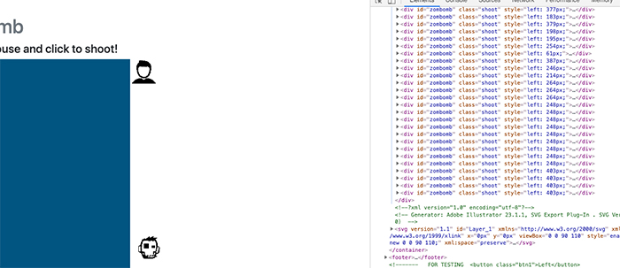
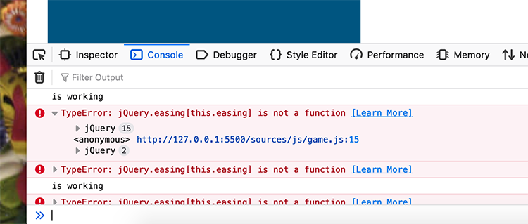
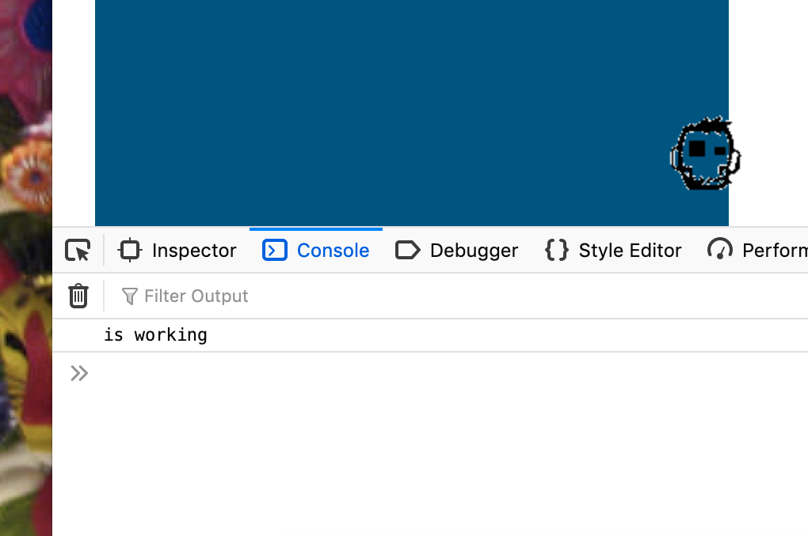

# Zombomb
### Interactive Frontend Development
### Second Milestone Project, Code Institute by Kervin Arias

### Content
1. [Project Purpose](#intro)
2. [Game Structure](#structure)
3. [UX Design](#ux-design)
4. [Code Structure](#code)
5. [Testing](#testing)
6. [References](#references)

**What's the aim of the game?**
The aim is to kill a flock of cannibal dead birds that are attacking the planet by using the tank to shoot zombies. This is my second milestone project for Code Institute using javascript.

I came across a very useful API https://www.pixijs.com/ this is an open source game engine available to make stunning graphics. Another useful source is https://developer.mozilla.org/en-US/docs/Games/Tutorials/2D_Breakout_game_pure_JavaScript which explains step by step how to get familiar with game development.

In order to achieve the game's best performance it was important to use game engine APIs such as PixiJS with buiilt-in plugins, game animations and actions.

### Requirements of the game 
This game is suitable for computers using a mouse. I tried to make it work for touch screens/mobile devices but my inexperience got me as far as shooting the bullets but not spinning. I would like to expand it to work with touch screen devices but due to time constraints I focused my efforts on making it work on desktops & laptops.

## Game Structure
As I was clueless how to start I followed the logic on this tutorial: https://github.com/kittykatattack/learningPixi. On this case study is shown the global scope variables and local functions to call and how to use those variables.

The first step was to get familiar with the game engine. If I wanted to work locally without waiting on my repository to update I had to get familiar with the UNIX command line and being able to set up a localhost, it's the only way PixiJS can simulate the interaction due to WebGL methods.

Next thing to achieve was the shooting action. I based mine on the coding solution: http://proclive.io/shooting-tutorial/ . I used it because it was exactly what I needed. I wanted to rotate my player from a fixed position on my game area.

My next step was to get familiar with sprites which are large files with all images that you're using in your game. A JSON file was created as an atlas to find and cut the elemnt we're using without having to load all images as single instruction each time. On this game the JSON file was used to create the explosion effect when the birds are shot.

* To generate my JSON file I used: https://www.codeandweb.com/free-sprite-sheet-packer

### Shooting
To be able to shoot the zombies I had to trigger an event on the "bullet" or `zombomb` in this case, to solve this, I decided to translate this `
` on Y coordinates and another `function` to call it back to the original position. This was achieved with `animate` and the call back function to reset the animation.

### UX Design

**Canvas**
One of the first problem was to make the canvas responsive. I added `class` for `canvas` element but it was stretching the image to the full width of the page making all graphics distorned. Pixi JS sorts this by adjusting the canvas size to `canvas.width = window.innerWidth; canvas.height = window.innerHeight; renderer.resize(canvas.width, canvas.height);`. Now it's fully responsive and letting the renderer decide the size with a css property set to 100%.
 

**UX - Checklist**
* Game logo and colour scheme
* Must be SVG or PNG graphics
* Icon that it's easy to recognise
* Clear instructions how to play
* Game Inter with an "alert" colour

# Code Structure
In order to achieve and understand the different parts comprising this project, I based my coding on this video tutorial https://www.youtube.com/watch?v=L07i4g-zhDA

**Game's Checklist**
This is a list of things we need to achieve in the coding:
* A canvas where the game is played (2D)
* Instructions how to play the game
* Game Components 
* Game Engine or API
* Score and timer
* Local Storage

### Collision of two sprites as killing action
Now it's time to kill some birds! I understand that if I'm making the 2 components to collide for that we need to create the 2D axis.

### Explosion effect
I based my code on this solution: https://github.com/pixijs/pixi-particles/blob/master/docs/examples/js/ParticleExample.js . I had to place my working variables into this code to make sure explosion effect works,  this is called Emitter.

### Testing
The first task was to make sure all files were properly connected by copying a simple javascript game from w3schools.com https://www.w3schools.com/graphics/tryit.asp?filename=trygame_default_gravity

I now encountered a problem. Using a option in Jquery to clone my `#bullet` on the game area and this was genereting a new `div` on my HTML file every time a click was triggered. So this `$("#zombomb").clone().appendTo("#gameArea");` wasn't a good idea.

**Solution**
 https://www.sitepoint.com/guide-jquery-animate-method/
I had to create a `var` from my `
` and animate this object.

To test Pixi JS classes I used its boilerplate platform online at: https://www.pixiplayground.com/#/edit and https://pixijs.download/v4.5.0/docs/PIXI.Graphics.html

>I'm finding hard at the moment to debug with Jasmine.
**Solution**
I'm using Chrome DevTools and https://developer.mozilla.org/ to find problems on my syntax. Codepen and jsfiddle to understand how all variables and functions work together.

One of the first problems that I'm having is to make an image active on the game. I'm getting the following error:
>Cannot read property 'getContext' of null
I was trying to use a `component` as my `const` or `let` variables, Firefox answer.
**Solution**
Warning: This object is only intended for code running with chrome privileges. Exposing the object to regular web code was a mistake. If you use this object on your web page, your site might break at any time! In current versions of Firefox only a few interfaces required for compatibility are still accessible. Don't use Components!

>Intented functions called in the right place of my code
**solution**
I'm using `console.log` inside a `function` to see if it's working and step through what I'm trying to achieve.  

>Shooting action not working
**Solution**
Thanks to the error notification on Google DevTools Console I discovered that `mousedown` couldn't work because `funtion(e)` wasn't defined.

>Shooting action not working on mobile
**Issue Unsolved**
I needed to call the same onClick action when shooting. However, for mobile renderers based on this solution https://www.html5gamedevs.com/topic/28105-touch-and-click-events-on-mobile/ and the reference of the interaction manager guide of Pixi JS https://pixijs.download/v4.5.0/docs/PIXI.interaction.InteractionManager.html#event:touchmove I managed to trigger the shoot action but the player is not spinning.
The player is firing the bullets but not spining on mobile devices.

>The game area is not responsive.
Using DevTools - CSS Grd Inspector I figured out that my game area had set `position: absolute;`. I removed it and it's respecting the grid on different devices now.
**Solution**
Setting the width and height of my `<canvas>` to `canvas.width = window.innerWidth; canvas.height = window.innerHeight; renderer.resize(canvas.width, canvas.height);` 

>Collision error
Collision detection it's not working when the bullet hits the bird.
**Solution**
Declaring the collision function globally and then calling it when the bullets are shot so the console starts the collision in between all bullets and birds. 

>Can't control the speed from a sprite.
A current problem that I'm encountering right now is my lack of understanding where to iterate parameters like speed in the pixi js engine. 

I had to restructure my game to have my sprites, bullets and enemies that repeat but don't create new objects as infinite loop on the DOM.
**Solution**
 Changing my enemies for `birdEnemies = []` to a image sprite that desapears when collided with the bullets and resets back on stage in a different location.

 >Time left showing 1000;
 * Requesting on `console.log()` the countdown as `.innerHTML`
 **Solution**
 `console.log(counter);`

 > Last Score null. When the site is running for the first time, "Last score" is showing null.
 **Solution**
 Checking if that variable had null value, and adding a string.
 Declaration reference https://stackoverflow.com/questions/6003884/how-do-i-check-for-null-values-in-javascript/6003958

  Testing was constant from the beginning of my project. I used this section as a record of my coding studies.  

# References
I based my bird enemies on this illustration: https://www.deviantart.com/isnevertimeatall/art/Zombie-bird-26385180

**Jquery, Animation, Pixi JS**
* Jquery Tutorial: https://www.freecodecamp.org/news/the-best-jquery-examples/
https://www.tutorialrepublic.com/jquery-tutorial/
* Javascript functions: https://www.freecodecamp.org/news/javascript-functions-af6f9186a553/
* Pixi JS documentation: https://pixijs.io/examples/#/demos-basic/container.js
https://www.html5gamedevs.com/
* JavaScript animation: http://www.gobiznow.com/jquery-animation-and-effect-4.html

**Shooting function**
http://proclive.io/shooting-tutorial/

**Primary game structure**
https://github.com/pixijs/pixi-particles/blob/master/docs/examples/js/ParticleExample.js

**My Coding Structure**
* Pixi Js functions: https://www.youtube.com/watch?v=eKsTVZKMeuI
* Pixi JS Library: http://pixijs.download/v4.3.4/docs/index.html

**Animation**
* Rotation code logic: https://stackoverflow.com/questions/4422293/rotate-an-image-around-its-center-in-canvas/44964567#44964567

* Explosion effect plugin for Pixi JS: https://github.com/pixijs/pixi-particles

**Mouse interaction**
* Code logic: http://jsfiddle.net/88526/1/
* Interaction events: http://pixijs.download/v4.3.4/docs/PIXI.interaction.InteractionEvent.html

**Local storage**
* https://stackoverflow.com/questions/47817325/storing-my-game-score-in-local-storage
