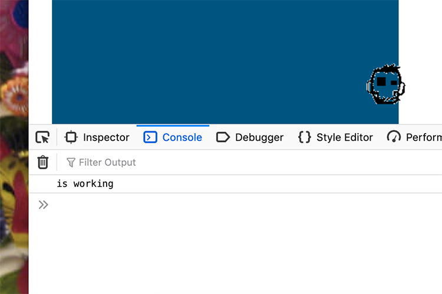

# Zombomb
### Interactive Frontend Development
### Second Milestone Project, Code Institute by Kervin Arias

**What's the aim of the game?**
To kill a flock of cannibal deadbirds using the zombies that we have as pandemic on the planet. 

I came across a very useful library https://www.pixijs.com/ this is an open source available to make stunning graphics. Another useful source is https://developer.mozilla.org/en-US/docs/Games/Tutorials/2D_Breakout_game_pure_JavaScript which explains step by step how to get familiar with game development.

In order to achieve the game's best performance it was important to use game engine APIs such as PixiJS.

### Requirements of the game 

**Game's Checklist**
This are the things we need to have on the game:
* A canvas where the game is played (2D)
* Instructions how to play the game
* Game Components 
* Game Engine or API 

## Game Structure
The first step was to get familiar with the game engine. It was a useful task to get familiar with the UNIX command line and being able to set up a localhost. 

My next step was to get familiar with Sprites which are large files with all images that you're using in your game. The creation of a JSON file as an atlas to find and cut the elemnt we're using without having to load all images as single instruction each time.
* To generate my JSON file I used: https://www.codeandweb.com/free-sprite-sheet-packer

The `#player` is able to shoot zombies to targets (birds). To control the action area I used `overflow: hidden;` on the body's CSS to make sure the action stays inside this game window or `#gameArea` in this case.

### Shooting
To be able to shoot the zombies, I had to trigger an event on the "bullet" or `zombomb` in this case, to solve this, I decided to translate this `
` on Y coordinates and another `function` to call it back to the original position. This was achieved with `animate` and the call back function to reset the animation.

### Collision as your weapon
Now it's time to kill some birds, I understand that if I'm making the 2 components to collide for that we need to creat the 2D axis.

### UX Design

**Canvas**
One of the first problem is to make the canvas responsive I added `class` for `canvas` element but it was stretching the image to the full width of the page making all graphics distorned.

I have got that by leaving the canvas on the index.html file but the functions of the game are not working. With the same example of game I made the game work and it's fully responsive . 

**Checklist for the Zombie component**
* Must be a SVG or PNG graphic
* Icon that it's easy to recognise

### Code Structure
In order to achieve and understand the different part componing this project, I based my coding on this video tutorial https://www.youtube.com/watch?v=L07i4g-zhDA

To make the player active, I have to call a function within the canvas using this player/user as object with a function to rotate and shoot to the target.

### Testing

My testing was constant from the beginning of my project. The first task was to make sure all files were properly connected my copying a simple javascript games from w3schools.com https://www.w3schools.com/graphics/tryit.asp?filename=trygame_default_gravity

I'm now checking that my code works too by simply `alert("hey!");` as the first line of my code.

To test PIXI.js functions I used its boilerplate platform online at: https://www.pixiplayground.com/#/edit

I want this testing section to be a journal of my debugging practices. I'm finding hard at the moment to debug with Jasmine. I'm using Chrome DevTools and https://developer.mozilla.org/ to find problem on my syntax.

One of the first problems that I'm having is to make an image active on the game getting the following error:

>Cannot read property 'getContext' of null

I was trying to use a component to make this component as an object but I read on developers mozilla:

> Warning: This object is only intended for code running with chrome privileges. Exposing the object to regular web code was a mistake. If you use this object on your web page, your site might break at any time! In current versions of Firefox only a few interfaces required for compatibility are still accessible. Don't use Components!

>mousemove on player not working

Thanks to the error notification on Google DevTools - Console I discovered that `mousemove` couldn't working because `funtions (e)` wasn't defined.

>Debug of my code
Finally I understood that I can use `console.log` inside a `function` to see if it's working what you're trying to do.  

I now encountered a problem. Using a simple option in Jquery to clone my `#bullet` on the game area and this was genereting a new `div` on my HTML file every time a click was triggered. So this `$("#zombomb").clone().appendTo("#gameArea");` wasn't a good idea.

 **Solution**
 https://www.sitepoint.com/guide-jquery-animate-method/
I had to create a `var` from my `
` and animate this object.

>Horizontal Scroll active, some margins off.
Using DevTools - CSS Grd Inspector I figured out that my game area had set `position: absolute;`, removed and it's respecting the grid on different devices now. 

>Can't control the speed from a Sprite
I current problem that I'm encountering right now it's my lack of understanding where to iterate parameters like speed to the pixi js engine. PIXI JS has a very good boiler to play https://www.pixiplayground.com/#/edit/DsTc1Aq0848CTPQRAiW__

https://github.com/pixijs/pixi.js/wiki/v5-Custom-Application-GameLoop

### References

I based my bird enemies on this illustration: https://www.deviantart.com/isnevertimeatall/art/Zombie-bird-26385180

**Understanding Jquery, SVG, etc**
https://www.tutorialrepublic.com/jquery-tutorial/

https://css-tricks.com/tag/svg/

**Shooting functions**
https://www.w3schools.com/jquery/eff_animate.asp
http://proclive.io/shooting-tutorial/

http://www.gobiznow.com/jquery-animation-and-effect-4.html

**Primary game structure**

https://www.freecodecamp.org/news/javascript-functions-af6f9186a553/

**My Coding Structure**
https://github.com/CodeExplainedRepo/FlappyBird-JavaScript/blob/master/flappyBird.js

https://www.freecodecamp.org/news/the-best-jquery-examples/

**Animations**
https://stackoverflow.com/questions/4422293/rotate-an-image-around-its-center-in-canvas/44964567#44964567
https://www.w3schools.com/jquery/tryit.asp?filename=tryjquery_animation2
https://stackoverflow.com/questions/25409023/ how-to-restart-reset-jquery-animation

**Jquery moving my character with mousemove**
https://www.w3schools.com/jquery/event_mouseover.asp

http://jsfiddle.net/88526/1/

https://www.w3schools.com/jquery/tryit.asp?filename=tryjquery_event_mousemove

https://www.w3schools.com/graphics/tryit.asp?filename=trygame_controllers_mouse